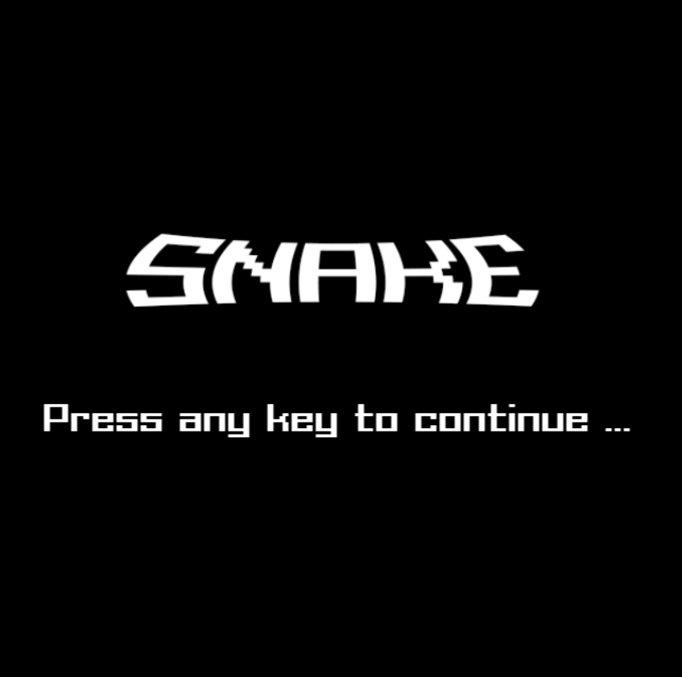
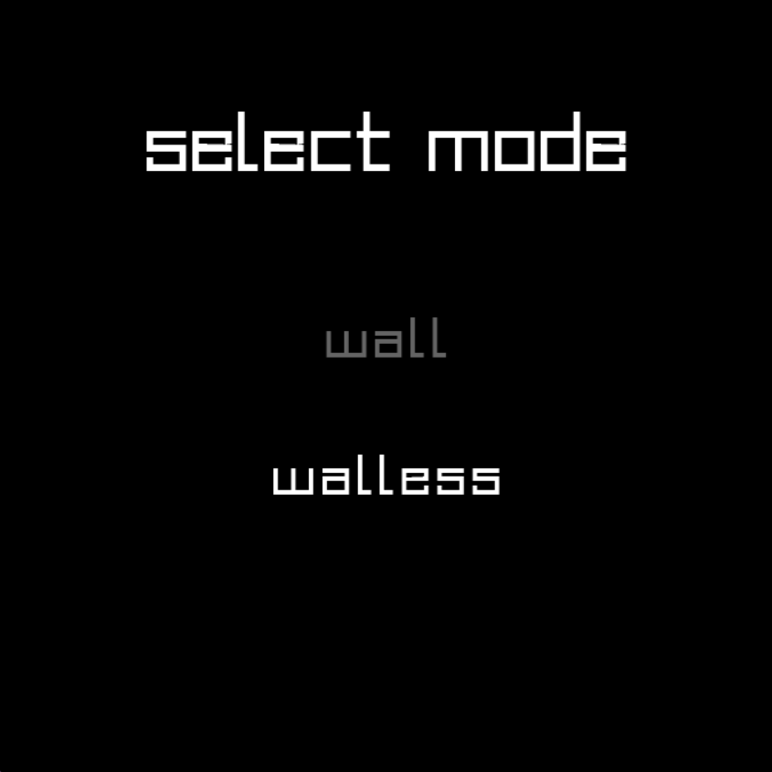
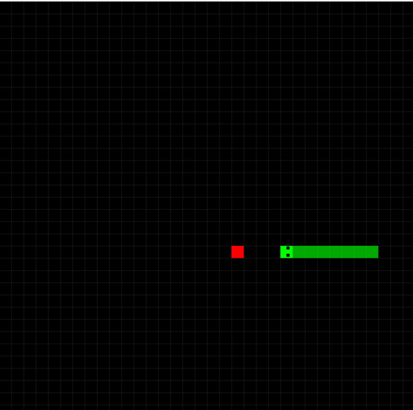

# Snake
- link preview game : [youtube]()
# Cài đặt
- bản chạy được luôn : tải snake.rar và giải nén từ [release](https://github.com/quanganh16705/quang_teo/releases/tag/release)
- bản chạy qua mã nguồn : clone repo hoặc Code -> download zip  
B1: Cài đặt makefile for window và mingw  
B2: Mở cmd rồi  cd đến folder src và gõ lệnh make
# Hình ảnh 
- game sử dụng font miễn phí trên mạng và hình ảnh đơn giản để hiển thị
# Giới thiệu
- Game rắn cổ điển 
- đồ họa trắng đen gợi cảm giác tuổi thơ
# Game
- Menu : nhấn nút bất kì để chơi

- mode select : nhấn lên hoặc xuống để chọn chế độ

- Chơi : dùng nút mũi tên để di chuyển 

- kết thúc : bấm R để chơi lại

