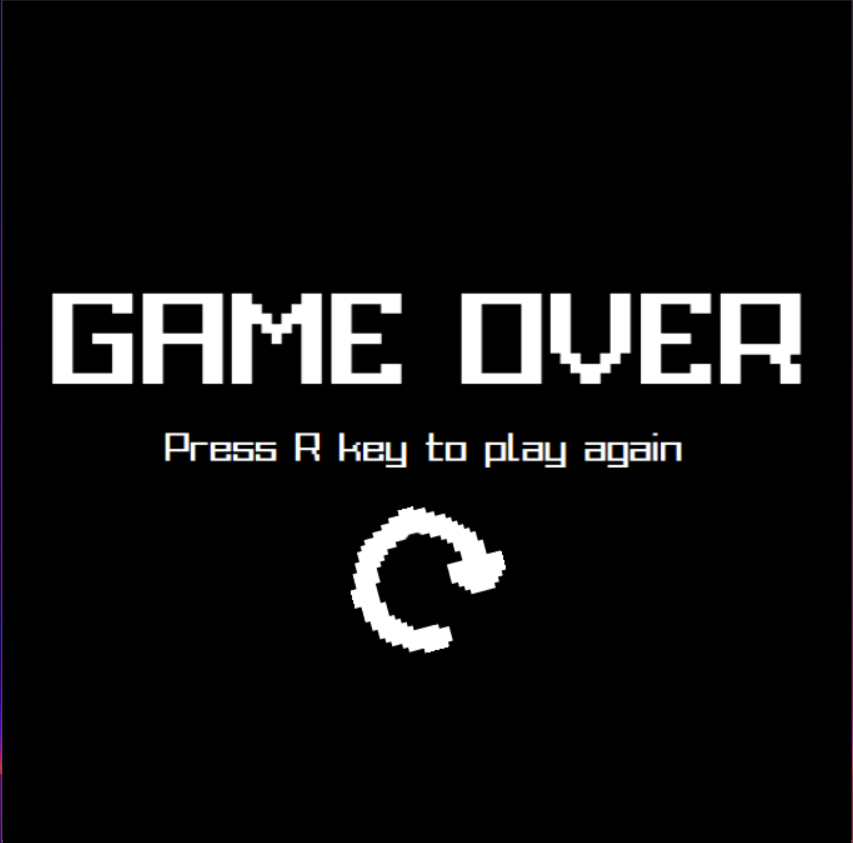

# Snake
- link preview game : [youtube](https://www.youtube.com/watch?v=Unx1dosIpzY)
# Cài đặt
- bản chạy được luôn : tải snake.rar và giải nén từ [release](https://github.com/quanganh16705/quang_teo/releases/tag/release)
- bản chạy qua mã nguồn : clone repo hoặc Code -> download zip  
  - B1: Cài đặt makefile for window và mingw  
  - B2: Mở cmd rồi  cd đến folder src và gõ lệnh make
# Hình ảnh 
- game sử dụng font miễn phí trên mạng và hình ảnh đơn giản để hiển thị
# Giới thiệu
- Game rắn cổ điển 
- đồ họa trắng đen gợi cảm giác tuổi thơ
# Game
- Menu : nhấn nút bất kì để chơi

- mode select : nhấn lên hoặc xuống để chọn chế độ
  

- Chơi : dùng nút mũi tên để di chuyển
  

- kết thúc : bấm R để chơi lại

# Source
Folder audio : chứa âm thanh 
Folder header : chứa header khai báo các thành phần game 
Folder img : chứa hình ảnh cần thiết hiển thị 
- Constants.h : chứa định nghĩa hằng, các hàm chung 
- Main.cpp : chứa logic trạng thái game : từ menu -> chọn chế độ -> chơi -> gameOver -> chọn chế độ (nếu chơi tiếp)... 
- Game.cpp : định nghĩa class Game chứa phần chơi và logic chính
  - khởi tạo rắn với độ dài 2
  - hàm generateFood() : random vị trí mồi
  - hàm run() : gameloop
  - update() : cập nhật hướng di chuyển, vị trí, kiểm tra có ăn mồi hay va chạm.
  - do cần xóa và thêm hai đầu dãy dữ liệu nên dùng cấu trúc dữ liệu deque để mô phỏng lại rắn
  - render() : dùng các hàm vẽ hình học game để giảm tải bộ nhớ 
- MainMenu.cpp : định nghĩa trạng thái MainMenu
  - bắt sự kiện SDL_KEYDOWN đơn giản để vào chọn chế độ
  - in ra tiêu đề game 
- modeSelect() : định nghĩa chế độ chọn màn chơi
  - hiển thị đơn giản UI
  - setAlphaMod để focus 
  - load hình ảnh từ folder img 
- gameOver() : game over
  - bấm R  chơi lại 
  - hiển thị đơn giản
  - load hình ảnh từ folder img
